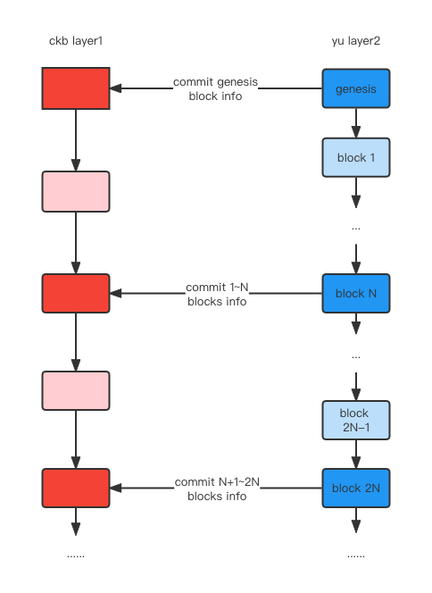

# yu-ckb-poa

Build contracts:

``` sh
capsule build
```

Run tests:

``` sh
capsule test
```
### Introduction
   
This contract is a poa chain from yu to ckb.
1. Deploy a ckb contract onto CKB layer1. In the ckb contract, we need to spec
   public-keys of these poa validators.
2. Start up the yu-sidechain, every N blocks, yu-sidechain will send
   (blockHash, height, txnRoot, stateRoot) of validators of these N blocks onto CKB Layer1.
   CKB Layer1 will validate these signatures and data.