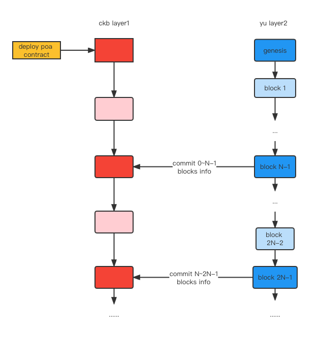

# yu-ckb-poa

Build contracts:

``` sh
capsule build
```

Run tests:

``` sh
capsule test
```
### Introduction
   
This contract is a poa chain from yu to ckb.
1. When yu-sidechain starts up, it sends ValidatorSet, blockHash, TxnRoot, StateRoot of
   genesis block to CKB Layer1. CKB Layer1 will store these data.
2. Starting with the second block(height = 1), every N blocks, yu-sidechain will send
   blockHash/ height/ txnRoot/ Multi-signatures of validators of these N blocks onto CKB Layer1.
   CKB Layer1 will validate these signatures and data.
3. In 2 above, if ValidatorSet changes(Increate or decrease), sidechain should also send
   these changes onto CKB Layer1.